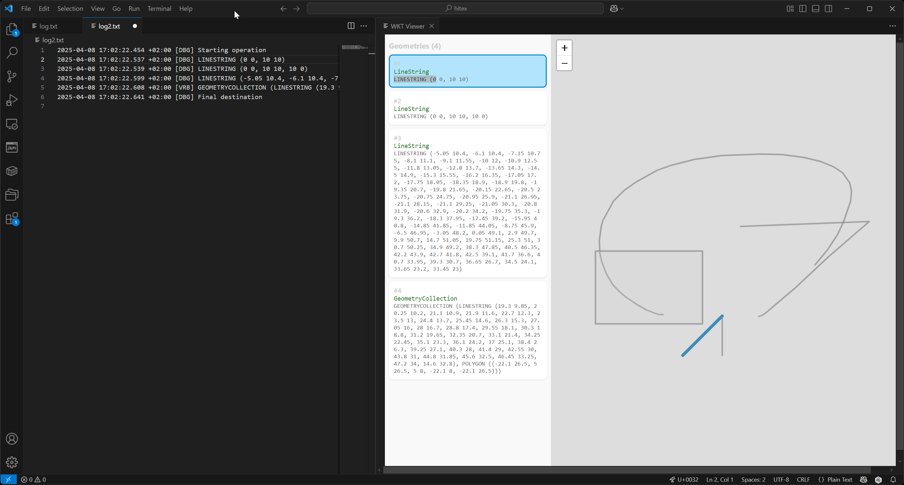

[](https://github.com/hallsbyra/wkt-viewer/actions/workflows/ci.yml)

# WKT Viewer

Visualize and navigate files containing WKT (Well Known Text) geometries in Visual Studio Code.



## Features

- Instantly visualizes all WKT geometries found in the current text editor.
- Highlights the "current" geometry as you navigate through the text.
- Selects the corresponding text in the editor when you click a geometry in the viewer.

## Quick Start

1. **Install:** Search for **WKT Viewer** in the VSCode Marketplace and install.
2. **Open a file** containing WKT geometries.
3. **Activate the viewer:** Use the command palette to run `Start WKT Viewer`.

## Extension Settings

_None yet._

## Development

### Running the Extension

- <kbd>F5</kbd>: Launches the extension and starts the development environment.
- <kbd>Ctrl</kbd>+<kbd>Shift</kbd>+<kbd>B</kbd> → **Start Dev Env**: Manually start the dev environment without launching the extension.

### Debugging

#### Extension Backend
- Set breakpoints and press <kbd>F5</kbd> to debug as usual.

#### Webview (React Frontend)
- Open your webview in VS Code.
- Open the Command Palette and run `Developer: Open Webview Developer Tools`.
- Use Chrome DevTools to set breakpoints and debug React code (source maps supported).

## Contributing

### Committing

We use [Release Please](https://github.com/googleapis/release-please), so please follow [Conventional Commits](https://www.conventionalcommits.org/):

- Use `feat` for new features (bumps minor version).
- Use `fix` for bug fixes (bumps patch version).

See [release-please-config.json](./release-please-config.json) for all supported commit types.

### Releasing

Squash merge the PR generated by release-please and it will

- update `CHANGELOG.md`.
- update `package.json`.
- create a [GitHub release](https://github.com/hallsbyra/wkt-viewer/releases).

### Publishing

To publish to the VSCode Marketplace:
```sh
npx vsce publish
