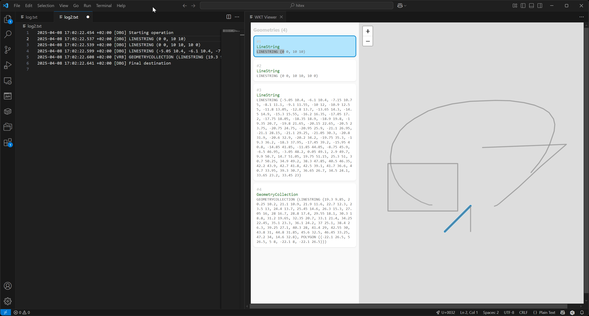

[](https://github.com/hallsbyra/wkt-viewer/actions/workflows/ci.yml)

# WKT Viewer

Visualize and navigate files containing WKT (Well Known Text) geometries in Visual Studio Code.



## Features

- Instantly visualizes WKT geometries in the current text editor.
- Highlights the current geometry as you navigate through text.
- Selects the corresponding text when you click a geometry in the viewer.

## Quick Start

1. Install **WKT Viewer** from the VS Code Marketplace.
2. Open a file containing WKT geometries.
3. Run `Start WKT Viewer` from the command palette.

## Extension Settings

None yet.

## Development

Requirements: Node.js 20 and npm.

```sh
npm ci
npm run build
npm test
```

### Running the Extension

- <kbd>F5</kbd>: Launch the extension in an Extension Development Host.
- <kbd>Ctrl</kbd>+<kbd>Shift</kbd>+<kbd>B</kbd> -> **Start Dev Env**: Start TypeScript watch mode and the Vite dev server.

### Debugging

- Extension backend: set breakpoints and press <kbd>F5</kbd>.
- Webview frontend: run `Developer: Open Webview Developer Tools` from the command palette.

## Contributing

We use [Release Please](https://github.com/googleapis/release-please), so commit messages should follow [Conventional Commits](https://www.conventionalcommits.org/). Release Please reads commits on `main`, so squash commit titles must follow this format too.

Use these types:

- `feat:` user-visible features. Shown in the changelog and bumps the minor version.
- `fix:` user-visible bug fixes. Shown in the changelog and bumps the patch version.
- `deps:` dependency updates worth mentioning. Shown in the changelog.
- `docs:`, `test:`, `refactor:`, `build:`, `chore:` internal changes. Hidden from the changelog.

Use `build:` for build, CI, packaging, and workflow changes. Do not use `ci:` in this repository.

For breaking changes, use `!` after the type or scope, or add a `BREAKING CHANGE:` footer.

Before publishing, verify a VSIX:

```sh
npm run package
```

Squash merge the PR generated by release-please. It updates `CHANGELOG.md`, updates `package.json`, and creates a [GitHub release](https://github.com/hallsbyra/wkt-viewer/releases).

To publish to the VS Code Marketplace:

```sh
npx vsce publish
```
